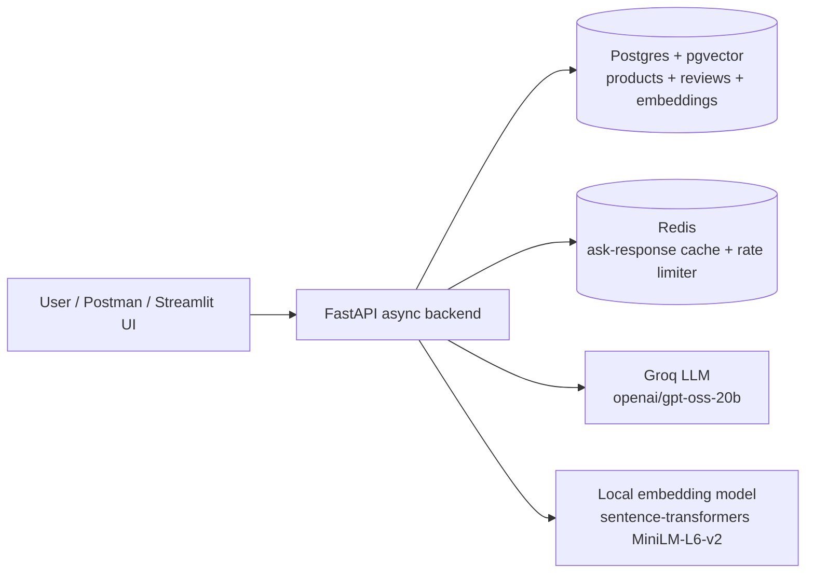

# BeautyRAG — Hybrid Search & RAG Shopping Assistant

Async FastAPI backend for grounded Q&A and recommendations over a beauty/skincare
product catalog (8,494 Sephora products, 18,008 reviews), built around **hybrid
search** — pgvector cosine similarity fused with Postgres full-text search via
Reciprocal Rank Fusion (RRF) — plus a grounded RAG endpoint with an anti-hallucination
guardrail, content-based recommendations, and Redis-backed caching/rate limiting.

## Architecture



One database for everything: `products` and `reviews` tables in Postgres, with a
pgvector `embedding` column (cosine distance, `<=>`) and a generated `tsvector`
column (GIN-indexed) living side by side — so vector and keyword search never risk
drifting out of sync with each other.

**`/search` and `/ask` retrieval flow:**
1. Run a pgvector cosine-similarity query and a Postgres full-text (`ts_rank`) query
   over `products`, independently.
2. Fuse the two ranked lists with Reciprocal Rank Fusion: each product's score is
   `sum(1 / (60 + rank))` across whichever list(s) it appears in.
3. For `/ask`: build a prompt containing only the fused top results (plus a couple of
   real review snippets per product) and instruct the model to answer using *only*
   that context, citing product IDs, and to say so when nothing fits — never invent a
   product. Cache the response in Redis; check cache before doing any of the above.

## Tech stack

| Concern | Choice |
|---|---|
| API | FastAPI, fully async (`asyncpg` / SQLAlchemy async engine) |
| Database | PostgreSQL + pgvector (Supabase) — structured data, full-text, and vectors in one store |
| Embeddings | `sentence-transformers/all-MiniLM-L6-v2`, run locally (no paid embedding API) |
| LLM | Groq (`openai/gpt-oss-20b`), OpenAI-compatible chat completions API |
| Cache / rate limit | Redis (Upstash) |
| Eval | Custom Precision@5 / Recall@5 / MRR harness, no external framework |

## API reference

### `GET /health`
Liveness/readiness check — confirms the API can reach both Postgres and Redis.

### `GET /search?q=...&mode=vector|keyword|hybrid&limit=10`
Search products by one retrieval mode at a time. Exposing all three separately (rather
than only shipping the hybrid result) is what makes the evaluation comparison below
possible.

```json
{
  "query": "lightweight moisturizer for oily skin",
  "mode": "hybrid",
  "results": [
    {"product_id": "P481390", "product_name": "Omega+ Complex Moisturizer",
     "brand_name": "Paula's Choice", "category": "Skincare > Moisturizers > Moisturizers",
     "price_usd": 37.0, "rating": 4.33, "reviews_count": 64, "score": 0.0164}
  ],
  "latency_ms": 394.6
}
```

### `POST /ask`
Grounded RAG Q&A. Retrieves via hybrid search, answers using only that context, and
refuses ("I don't have enough information...") rather than inventing a product when
nothing in the catalog is relevant. Responses are cached in Redis (normalized question,
short TTL) and the endpoint is rate-limited (basic per-IP fixed window, since it's the
one route that calls an external LLM).

```json
// request
{"question": "What is a good vitamin C serum for brightening skin?"}

// response
{
  "answer": "A solid choice is the 15% Vitamin C and EGF Brightening Serum... [P455368]",
  "cited_product_ids": ["P455368", "P476428"],
  "latency_ms": 6051.9,
  "cached": false
}
```

### `GET /recommend/{product_id}?limit=10`
Content-based "similar products": catalog neighbors by embedding cosine similarity,
re-ranked with a small rating boost. Returns 404 for an unknown `product_id`.

### Postman collection
[`postman/BeautyRAG.postman_collection.json`](postman/BeautyRAG.postman_collection.json)
covers every endpoint above, including the `/ask` refusal guardrail. Import it into
Postman and set the `base_url` collection variable to your running instance.

## Running it

**Prerequisites:** Python 3.12 (3.14 will fail — `pydantic-core`/`asyncpg` don't have
wheels for it yet), a Postgres instance with the `vector` extension available (e.g.
Supabase free tier), and a Redis instance (e.g. Upstash free tier).

```bash
# 1. Install
python -m venv .venv
.venv/Scripts/activate   # or `source .venv/bin/activate` on macOS/Linux
pip install -r requirements.txt

# 2. Configure — copy .env.example to .env and fill in GROQ_API_KEY, DATABASE_URL, REDIS_URL
cp .env.example .env

# 3. Set up the schema
python -m data.init_db

# 4. Ingest the dataset (downloads via Kaggle API into data/raw/, then embeds + loads)
kaggle datasets download -d nadyinky/sephora-products-and-skincare-reviews -p data/raw --unzip
python -m data.ingest

# 5. Run the API
uvicorn app.main:app --reload
# -> http://127.0.0.1:8000/docs
```

**Or with Docker** (once `.env` is filled in and the DB is already ingested — the
image doesn't run ingest itself):
```bash
docker build -t beautyrag .
docker run -p 8000:8000 --env-file .env beautyrag
```

**Run the eval harness:**
```bash
python -m eval.run_eval
```

## Retrieval evaluation (18 hand-labeled queries)

<!-- EVAL_TABLE_START -->
| Mode | Precision@5 | Recall@5 | MRR |
|---|---|---|---|
| Keyword (full-text) | 0.400 | 0.140 | 0.477 |
| Vector only | 0.322 | 0.094 | 0.481 |
| Hybrid (RRF) | 0.411 | 0.147 | 0.704 |
<!-- EVAL_TABLE_END -->

Hybrid wins on every metric, and especially on MRR (0.704 vs. 0.477–0.481) -- it's
consistently getting a relevant product into the top couple of results even in cases
where neither individual method ranks a relevant item first. Generated by
`eval/run_eval.py`; relevant-product labels for the 18 queries were derived from
targeted category/keyword filters against the catalog (see `eval/queries.py` and
`eval/_build_queries.py`) rather than a full manual review of all 8,494 products.

## Caching impact

Identical `/ask` questions are served from Redis instead of re-calling Groq:
**~6,400ms cold → ~23ms cached** (~280x) in manual testing, on a 300s TTL keyed to
the normalized question text.

## Future improvements

- **Automated test suite.** Right now correctness is checked manually (`/health`,
  ad-hoc queries) plus the retrieval-quality eval harness (`eval/run_eval.py`).
  A `pytest` suite covering the API routes (e.g. unknown `product_id`, empty
  search results, malformed requests) would be a natural next step beyond the
  weekend build.
- **Real hand-labeled eval set.** The current 18-query eval set's ground truth comes
  from metadata filters rather than a human reading each candidate product; a true
  manual pass (or a second labeler for inter-rater agreement) would make the
  Precision/Recall numbers more defensible.
- **Review embeddings.** Only products are embedded today; embedding representative
  review snippets separately could improve retrieval for queries that hinge on
  subjective experience ("doesn't clog pores", "no white cast") rather than catalog
  metadata.
