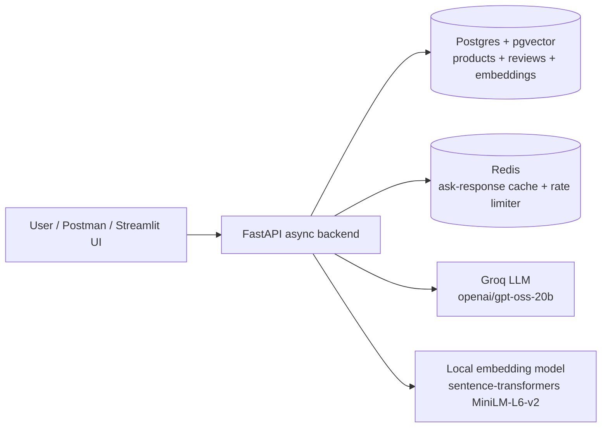

# BeautyRAG — Hybrid Search & RAG Shopping Assistant

Async FastAPI backend for grounded Q&A and recommendations over a beauty/skincare
product catalog (8,494 Sephora products, 18,008 reviews), built around **hybrid
search** — pgvector cosine similarity fused with Postgres full-text search via
Reciprocal Rank Fusion (RRF) — plus a grounded RAG endpoint with an anti-hallucination
guardrail, content-based recommendations, and Redis-backed caching/rate limiting.

**Live demo:** API on Render — https://beautyrag-pml6.onrender.com/docs · UI on
Streamlit Community Cloud — https://beautyrag-gpbljutbwqbk57rz2zcyp7.streamlit.app
(free-tier hosting, so the API cold-starts after 15 minutes idle — give it ~30-50s on
the first request).

## Architecture



One database for everything: `products` and `reviews` tables in Postgres, with a
pgvector `embedding` column (cosine distance, `<=>`) and a generated `tsvector`
column (GIN-indexed) living side by side — so vector and keyword search never risk
drifting out of sync with each other.

**`/search` and `/ask` retrieval flow:**
1. Run a pgvector cosine-similarity query and a Postgres full-text (`ts_rank`) query
   over `products`, independently.
2. Fuse the two ranked lists with Reciprocal Rank Fusion: each product's score is
   `sum(1 / (60 + rank))` across whichever list(s) it appears in.
3. For `/ask`: build a prompt containing only the fused top results (plus a couple of
   real review snippets per product) and instruct the model to answer using *only*
   that context, citing product IDs, and to say so when nothing fits — never invent a
   product. Cache the response in Redis; check cache before doing any of the above.

## Tech stack

| Concern | Choice |
|---|---|
| API | FastAPI, fully async (`asyncpg` / SQLAlchemy async engine) |
| Database | PostgreSQL + pgvector (Supabase) — structured data, full-text, and vectors in one store |
| Embeddings | `sentence-transformers/all-MiniLM-L6-v2`, run locally (no paid embedding API) |
| LLM | Groq (`openai/gpt-oss-20b`), OpenAI-compatible chat completions API |
| Cache / rate limit | Redis (Upstash) |
| Eval | Custom Precision@5 / Recall@5 / MRR harness, no external framework |

## API reference

### `GET /health`
Liveness/readiness check — confirms the API can reach both Postgres and Redis.

### `GET /search?q=...&mode=vector|keyword|hybrid&limit=10`
Search products by one retrieval mode at a time. Exposing all three separately (rather
than only shipping the hybrid result) is what makes the evaluation comparison below
possible.

```json
{
  "query": "lightweight moisturizer for oily skin",
  "mode": "hybrid",
  "results": [
    {"product_id": "P481390", "product_name": "Omega+ Complex Moisturizer",
     "brand_name": "Paula's Choice", "category": "Skincare > Moisturizers > Moisturizers",
     "price_usd": 37.0, "rating": 4.33, "reviews_count": 64, "score": 0.0164}
  ],
  "latency_ms": 394.6
}
```

### `POST /ask`
Grounded RAG Q&A. Retrieves via hybrid search, answers using only that context, and
refuses ("I don't have enough information...") rather than inventing a product when
nothing in the catalog is relevant. Responses are cached in Redis (normalized question,
short TTL) and the endpoint is rate-limited (basic per-IP fixed window, since it's the
one route that calls an external LLM).

```json
// request
{"question": "What is a good vitamin C serum for brightening skin?"}

// response
{
  "answer": "A solid choice is the 15% Vitamin C and EGF Brightening Serum... [P455368]",
  "cited_product_ids": ["P455368", "P476428"],
  "latency_ms": 6051.9,
  "cached": false
}
```

### `GET /recommend/{product_id}?limit=10`
Content-based "similar products": catalog neighbors by embedding cosine similarity,
re-ranked with a small rating boost. Returns 404 for an unknown `product_id`.

### Postman collection
[`postman/BeautyRAG.postman_collection.json`](postman/BeautyRAG.postman_collection.json)
covers every endpoint above, including the `/ask` refusal guardrail. Import it into
Postman and set the `base_url` collection variable to your running instance.

## Running it

**Prerequisites:** Python 3.12 (3.14 will fail — `pydantic-core`/`asyncpg` don't have
wheels for it yet), a Postgres instance with the `vector` extension available (e.g.
Supabase free tier), and a Redis instance (e.g. Upstash free tier).

```bash
# 1. Install
python -m venv .venv
.venv/Scripts/activate   # or `source .venv/bin/activate` on macOS/Linux
pip install -r requirements.txt

# 2. Configure — copy .env.example to .env and fill in GROQ_API_KEY, DATABASE_URL, REDIS_URL
cp .env.example .env

# 3. Set up the schema
python -m data.init_db

# 4. Ingest the dataset (downloads via Kaggle API into data/raw/, then embeds + loads)
kaggle datasets download -d nadyinky/sephora-products-and-skincare-reviews -p data/raw --unzip
python -m data.ingest

# 5. Run the API
uvicorn app.main:app --reload
# -> http://127.0.0.1:8000/docs
```

**Or with Docker** (once `.env` is filled in and the DB is already ingested — the
image doesn't run ingest itself):
```bash
docker build -t beautyrag .
docker run -p 8000:8000 --env-file .env beautyrag
```

**Run the eval harness:**
```bash
python -m eval.run_eval
```

**Run the latency benchmark** (cache miss vs. hit, `/ask` -- spins up its own
local server on port 8001, paced to stay under Groq's free-tier rate limit,
takes a few minutes):
```bash
python -m eval.latency_bench
```

**Run the Streamlit UI** (needs the API running separately, per above). It lives in
`ui/` with its own minimal `requirements.txt` (just `streamlit` + `requests`) so
deploying it doesn't drag in the backend's heavier dependencies (asyncpg, torch, ...):
```bash
pip install -r ui/requirements.txt
streamlit run ui/streamlit_app.py
```
A chat box for `/ask`, a search box exposing all three retrieval modes, and a
similar-products lookup, each rendering results as product cards. The API base URL
is configurable in the sidebar, so the same UI works against a local or deployed
backend. Verified with Streamlit's own headless `AppTest` framework (all three tabs,
against a live local API) since no browser was available in the dev environment this
was built in.

## Retrieval evaluation (12 hand-labeled queries)

<!-- EVAL_TABLE_START -->
| Mode | Precision@5 | Recall@5 | MRR |
|---|---|---|---|
| Keyword (full-text) | 0.183 | 0.019 | 0.208 |
| Vector only | 0.250 | 0.059 | 0.438 |
| Hybrid (RRF) | 0.283 | 0.060 | 0.438 |
<!-- EVAL_TABLE_END -->

Hybrid wins on Precision@5 and Recall@5, and ties Vector on MRR. Generated by
`eval/run_eval.py` against `eval/queries.py`.

### How the ground truth was built

Ground truth comes from a two-stage process designed specifically to avoid
self-grading: (1) Claude Code produced a purely mechanical SQL/ILIKE candidate
shortlist per query -- explicit literal constraints only (category, price,
named ingredients, exact keyword phrases), no embeddings, no ranking, no LLM
judgment (`eval/candidate_shortlist.md`, gitignored -- a scratch audit trail,
not the ground truth itself); (2) every candidate row was then judged by hand
against a consistent "genuine functional match" standard (e.g. a gel-cream
counts as a moisturizer even without the word "moisturizer" in its name; a
face oil/toner/essence/serum does not count as a moisturizer even if it
carries the moisturizer category tag; a bundle/kit/set doesn't count as a
single product match; SPF alone doesn't disqualify a moisturizer; "under $X"
is strict, "X or higher" is inclusive). The labels live in
`eval/eval_ground_truth_labels.json`; `eval/_labels_from_shortlist.py`
regenerates `eval/queries.py` from it.

Eight of the twenty original test queries are **deliberately excluded** from
the table above -- not silently scored as zero, genuinely left out -- because
no non-arbitrary candidate set could be established for them:

| Query | Why it's excluded |
|---|---|
| "something to stop my skin looking oily by midday" | No literal, filterable constraint at all -- a subjective goal, not a stated category/ingredient/price. |
| "sunscreen that doesn't leave a white cast" | Negation query -- zero literal matches for "white cast" anywhere in the catalog's short tag-style descriptions, which was never going to happen; a known hard case for keyword-based negation, not a data gap. |
| "makeup that lasts through a 12-hour work shift" | Only a loose 2,369-row Makeup-category fallback exists; the actual claim isn't filterable. |
| "a foundation people say doesn't oxidize" | Zero matches, as expected -- "doesn't oxidize" is review/community language, not product marketing copy. |
| "an affordable everyday moisturizer" | "affordable"/"everyday" are unfilterable; only an 804-row Moisturizer-category fallback remains, too broad to sample meaningfully. |
| "a product from CeraVe" | Adversarial: CeraVe is verified absent from the catalog's 304 brands. Zero rows is the *correct* answer -- tests whether the app admits it doesn't carry a brand rather than hallucinating a substitute. |
| "what's the best laptop for gaming" | Adversarial, out-of-domain: no relevant category exists at all in a beauty catalog. Tests refusal, not retrieval. |
| "best gift for someone who's really into skincare" | "best gift" is unfilterable; "skincare" alone maps to a 2,420-row category, too broad to shortlist. |

This honesty costs something visible: these numbers are noticeably lower than
an earlier pass with looser, heuristically-derived labels (hybrid
Precision@5 was 0.411 there, 0.283 here) -- not because retrieval got worse,
but because the old labels were more self-confirming, having come from
filter logic similar to what was being measured. Several of the 12 scored
queries are also deliberately harder than a typical eval query -- an exact
price ceiling, multi-ingredient co-occurrence, a negative constraint ("gel
... not cream") -- rather than picked to flatter the system.

## Caching impact

Identical `/ask` questions are served from Redis instead of re-calling Groq.
Real measured latency, not an estimate -- `eval/latency_bench.py`, 3
repetitions x 20 queries, Redis cache cleared before each repetition so
every "miss" sample is genuine rather than silently already cached:

| | p50 | p95 | n |
|---|---|---|---|
| Cache miss (hybrid search + Groq) | 2,598.92ms | 3,300.76ms | 60 |
| Cache hit (Redis only) | 58.24ms | 60.70ms | 60 |

**~44.6x faster at p50, ~54.4x faster at p95.** TTL is 300s, keyed on the
normalized question text (`app/cache.py`). n=60 per group is a modest sample
for a p95 estimate -- treat it as directionally solid rather than a tight
bound, especially on the miss side where LLM response time itself has real
variance (min 1,983.87ms / max 5,814.50ms across the 60 runs).

## Deploying to free-tier hosting: what broke and why

The API is deployed to Render's free web service tier (750 hrs/month, no card
required) and the UI to Streamlit Community Cloud — both genuinely free, but neither
is a drop-in target for a `torch`-dependent async backend. Four separate issues
showed up, each with a distinct root cause:

**1. Out-of-memory before the app even opened a port.** Render's free tier caps a
service at 512MB RAM. The default PyPI `torch` wheel bundles CUDA libraries that
aren't needed for CPU-only inference, and just importing `sentence-transformers`
(which imports `torch`) pushed memory well past 512MB — the container was OOM-killed
during startup, before Uvicorn ever bound to a port. Fix: install the CPU-only torch
build explicitly in the Dockerfile —
```dockerfile
RUN pip install --no-cache-dir torch --index-url https://download.pytorch.org/whl/cpu
```
— which drops the image's memory footprint enough to fit comfortably.

**2. Database unreachable despite a correct connection string.** Supabase's direct
connection host (`db.<ref>.supabase.co`) resolves to an IPv6 address only in most
regions now, and Render's free tier has no outbound IPv6 route. `/health` reported
`database: false` with no useful error beyond a connection timeout. Fix: switch to
Supabase's connection pooler host (`aws-0-<region>.pooler.supabase.com`), which is
IPv4-reachable.

**3. Prepared-statement errors under real traffic, only after switching to the
pooler.** Once on the pooler, `/search` intermittently threw
`asyncpg.exceptions.DuplicatePreparedStatementError`. Root cause: Supabase's pooler
runs in transaction mode, multiplexing client connections across a shared pool of
backend Postgres sessions. asyncpg names each prepared statement with a plain
per-connection counter (`__asyncpg_stmt_1__`, `_2__`, ...) that restarts at 1 for
every new connection — so two concurrent requests (in practice, Render's own
health-check polling overlapping a real request) could each try to prepare
`__asyncpg_stmt_1__` on the same backend session and collide. Fixed with three
changes together in `app/db.py`: `statement_cache_size=0` (disable asyncpg's own
statement cache, which isn't valid across a pooled connection anyway), `NullPool`
(stop SQLAlchemy from *also* pooling connections on top of the pooler), and a
UUID-based `prepared_statement_name_func` so statement names are globally unique
regardless of how the pooler multiplexes underneath. Verified by firing 8 concurrent
search requests locally before and after — reproduced the collision, then confirmed
it was gone.

**4. Streamlit Cloud installing the wrong dependencies entirely.** Streamlit
Community Cloud installs whatever `requirements.txt` sits next to the main module —
with `streamlit_app.py` originally at the repo root, that meant installing the
*entire backend's* dependency set (`asyncpg`, `torch`, `sentence-transformers`, ...)
just to run a thin UI that only needs `streamlit` and `requests`. It also broke the
deploy outright: Streamlit Cloud's Python 3.14 runtime has no prebuilt wheel for
`asyncpg`, and building it from source fails against 3.14's changed C API. Fixed by
moving the app to `ui/streamlit_app.py` with its own minimal `ui/requirements.txt`,
so Streamlit Cloud only installs what the UI actually needs.

## Future improvements

- **Automated test suite.** Right now correctness is checked manually (`/health`,
  ad-hoc queries) plus the retrieval-quality eval harness (`eval/run_eval.py`).
  A `pytest` suite covering the API routes (e.g. unknown `product_id`, empty
  search results, malformed requests) would be a natural next step beyond the
  weekend build.
- **Review embeddings.** Only products are embedded today; embedding representative
  review snippets separately could improve retrieval for queries that hinge on
  subjective experience ("doesn't clog pores", "no white cast") rather than catalog
  metadata.
